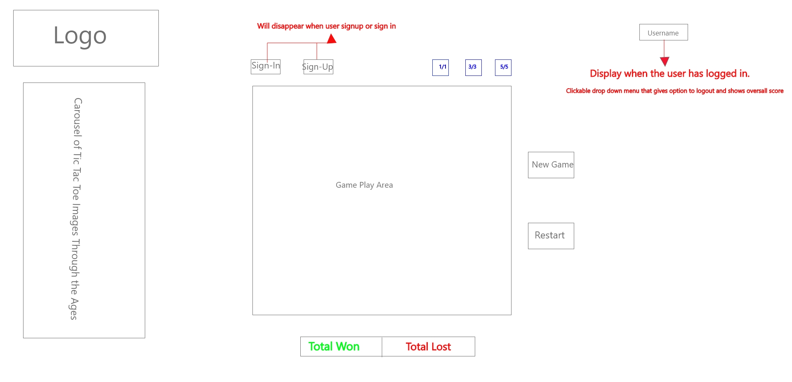
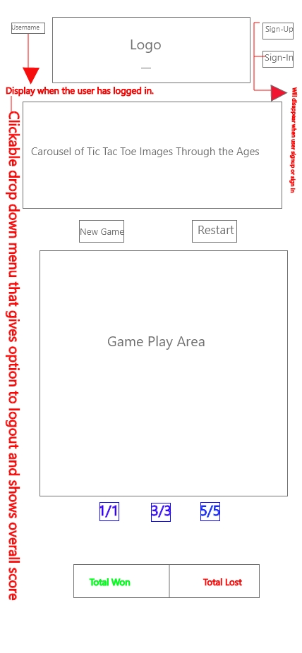

# Tic-Tac-Toe:The Ancient Game of X's and O's

Play one of the oldest games still played today. You will be given the choice of playing as X or O. On a 3X3 board you will place your mark depending on if it is your turn to go first or second. The object of the game is to be the first person to place all their marks vertical, diagonal, or horizontal in a row.

## Game Link

- [Tic Tac Toe Game](https://github.com/bbeckford305/Tic-Tac-Toe-Client)

## Planning

### User Stories

* As a user I want to be able to sign in or sign up
* As a user I want to be able to start a new game
* As a user I want to be able to restart my game while playing
* As a user I want to be able to sign out when done playing

### Laptop Wireframe

### Phone Wireframe

